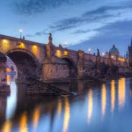

# Charles Bridge

Charles Bridge is a historic bridge that crosses the Vltava river in Prague. It is famous for its Gothic design and statues.

The bridge is a popular tourist destination and provides stunning views of Prague Castle and the river.

## Gallery

  

Welcome and enjoy, yo!

In this case I need to get the text a bit longer, 
does the scroll box work... 
## DOES THE SCROLL BOX WORK, MAN?

I am quite certain it should be still. 
What is certainty? It's definitely not definive. It's just there. Present. 
